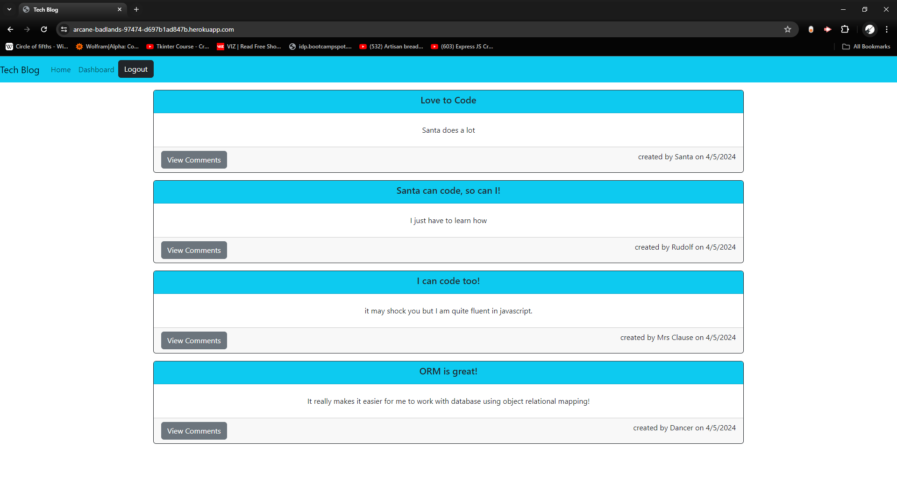

# Tech Blog

  ## 

  ## Table of Contents

 [Description](#description)

 [Installation](#installation)

 [Usage](#usage)

 [GitHub Links](#github-links)

 [Contributors](#contributors)
 
 [Tests](#tests)
 
 [Questions](#questions)

 [License](#license)
 

  ## Description

    A blog where software developers can post about topics that interest them and comment on others posts. User is able to make their own profile, and once it is made they are than able to interact with the site. A user may still view posts without logging in, but they can not make a new post or comment until they either make a new account or sign in.

  ## Installation

    none

  ## Usage

    user can make a profile and create posts. user is also able to delete and update any posts that they created. the intended use for this site is for developers to have a place to share topics that interest them. 

  ## Github Links

  
  [TimL94's Github Repository For this Project](https://www.github.com/TimL94/Tech-Blog)
  
  [Tech-Blog](https://arcane-badlands-97474-d697b1ad847b.herokuapp.com/)
    

  ## Contributors

    bycrypt, dotenv, express, handlebars, mysql2, nodemon, sequelize

  ## Tests

    none

  ## Questions

    none
    
  ## License

  This project is licensed under the [MIT License](https://opensource.org/licenses/MIT)